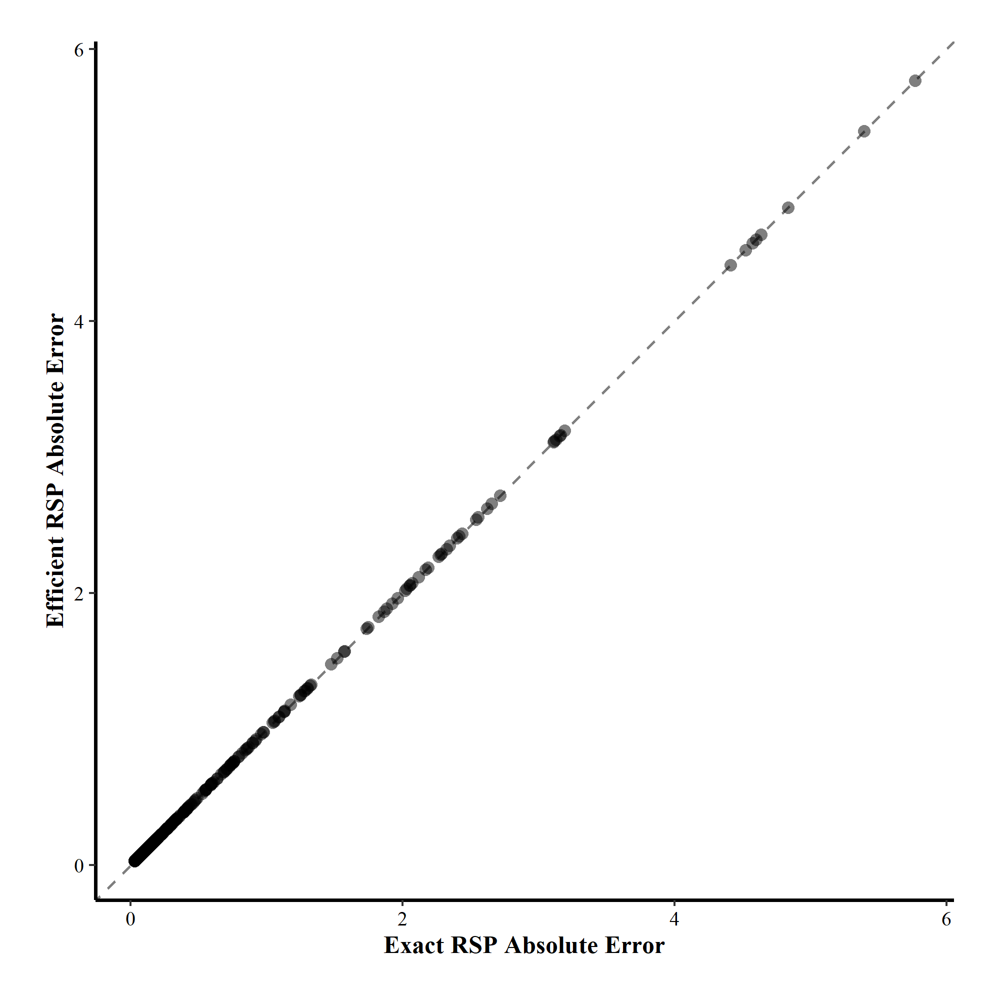
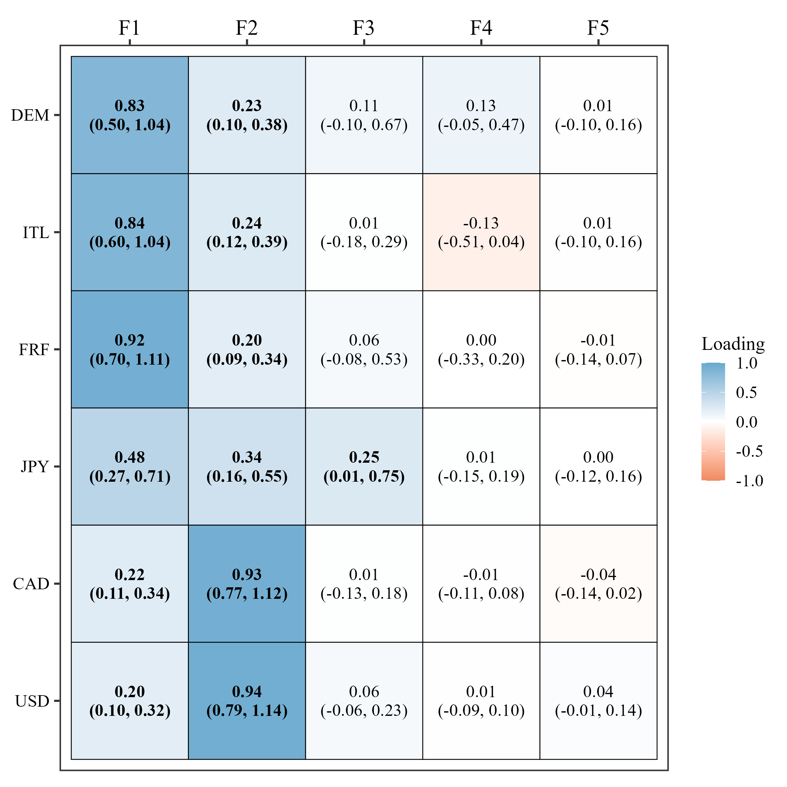

Factor models are a widely used latent-variable approach that represent dependence among observed variables through a smaller set of unobserved variables. They are foundational in modern psychometrics [@thurstone1947multiple; @joreskog1969general; @vanBork2024] and also serve as a workhorse for covariance matrix estimation in high-dimensional settings [@bhattacharya2011sparse; @Fan2008; @Stevenson2025group]. The standard factor model assumes that, for each observation $i$, the $J$-dimensional response vector $\mathbf{y}_i$ is expressed as
$$
\mathbf{y}_i = \boldsymbol\nu + \mathbf\Lambda\cdot\boldsymbol\eta_{i} + \boldsymbol\varepsilon_{i},
$${#eq-01}
where $\boldsymbol\nu\in\mathbb{R}^J$ is the vector of intercepts of the $J$ observed variables, $\mathbf\Lambda\in\mathbb{R}^{J\times M}$ is the factor-loading matrix, $\boldsymbol\eta_i\in\mathbb{R}^M$ is the vector of latent factor scores for observation $i$, and $\boldsymbol\varepsilon_i\in\mathbb{R}^J$ captures idiosyncratic variation not explained by the common factors. It is assumed that $\boldsymbol\eta_i$ and $\boldsymbol\varepsilon_i$ are independent latent variables with distributions
$\boldsymbol\eta_i\sim \mathcal{MVN}\left(\boldsymbol 0,\;\mathbf{I}_M\right)$ and $\boldsymbol{\varepsilon}_i\sim\mathcal{MVN}\left(\boldsymbol 0,\;\mathbf\Psi\right)$,
where $\mathbf\Psi\in\mathbb{R}^{J\times J}$ is a diagonal matrix of unique variances. In this paper, we focus on the unrestricted factor model---also known as Exploratory Factor Analysis (EFA)---in which all elements of $\mathbf\Lambda$ are freely estimated.

Given the assumption of local independence, and letting $\boldsymbol\theta = (\boldsymbol\nu, \mathbf\Lambda, \mathbf\Psi)$ denote the collection of structural parameters, the conditional distribution of $\mathbf{y}_i$ is given by
$$
\mathbf{y}_i \mid \boldsymbol\eta_i, \boldsymbol\theta \sim \mathcal{MVN}\!\left(\boldsymbol\nu + \mathbf\Lambda \cdot\boldsymbol\eta_i,\;\mathbf\Psi\right), 
$${#eq-02}
and integrating out $\boldsymbol\eta_i$ yields the corresponding marginal model,
$$
\mathbf{y}_i \mid \boldsymbol\theta \sim \mathcal{MVN}\!\left(\boldsymbol\nu,\;\mathbf\Sigma\right),
\qquad
\mathbf\Sigma = \mathbf\Lambda\cdot\mathbf\Lambda^\top + \mathbf\Psi.
$${#eq-03}

Here, $\boldsymbol\nu$ and $\mathbf\Sigma$ are commonly referred to as the model-implied mean vector and the model-implied covariance matrix, respectively. Since $\mathbf\Psi$ is diagonal, the covariance structure among the observed variables---represented by the off-diagonal elements of $\mathbf\Sigma$---is entirely governed by the term $\mathbf\Lambda\cdot\mathbf\Lambda^\top$.

The marginal representation of @eq-03 is convenient because it makes explicit what the data likelihood "sees": once the latent factors are integrated out, the likelihood depends on $\mathbf{\Lambda}$ solely through the implied covariance $\mathbf{\Sigma}$. Consequently, any alternative loading matrix $\mathbf\Lambda^\bullet$ satisfying $\mathbf\Lambda^\bullet\cdot\mathbf\Lambda^{\bullet\top}=\mathbf\Lambda\cdot\mathbf\Lambda^\top$ implies the same $\mathbf\Sigma$ and yields an identical likelihood, meaning $\mathbf\Lambda$ is not uniquely identified^[Although our focus is on the rotational non-identifiability of $\mathbf\Lambda$, the uniqueness matrix $\mathbf\Psi$ must also be identified. Throughout the paper, we assume $M \leq (J-1)/2$ and that $\mathbf\Lambda$ has no zero rows (i.e., each observed variable loads on at least one factor). These conditions are sufficient for $\mathbf\Psi$ to be identifiable.] [@anderson1956statistical; @millsap2001statistical]. 

This lack of uniqueness stems from the model's invariance under orthogonal transformations. Specifically, for any orthogonal matrix $\mathbf{Q}\in\mathbb{R}^{M\times M}$ with $\mathbf{Q}\cdot\mathbf{Q}^\top=\mathbf{I}_M$, the rotated loadings $\mathbf\Lambda^\bullet = \mathbf\Lambda\cdot\mathbf{Q}$ automatically satisfy
$$
\mathbf\Lambda^\bullet\cdot (\mathbf\Lambda^\bullet)^\top = \mathbf\Lambda\cdot \mathbf{Q}\cdot(\mathbf\Lambda\cdot \mathbf{Q})^\top=\mathbf\Lambda\cdot \mathbf{Q}\cdot\mathbf{Q}^\top\cdot \mathbf\Lambda^\top = \mathbf\Lambda\cdot \mathbf{I}_M\cdot \mathbf\Lambda^\top= \mathbf\Lambda \cdot \mathbf\Lambda^\top,
$$
and therefore leave $\mathbf\Sigma$ unchanged. Note also that simple column sign flips and permutations in $\mathbf\Lambda$ are themselves orthogonal transformations.

To resolve this ambiguity in frequentist factor analysis, rotational indeterminacy is typically handled by choosing a rotation matrix $\mathbf{Q}$ designed to maximize interpretability. Common choices include orthogonal rotations such as Varimax [@kaiser1958varimax], which preserve uncorrelated factors, and oblique rotations such as Oblimin [@JennrichSampson1966], which allow correlated factors. From the rotated solution, the final column order and signs are typically fixed by simple conventions based on the strongest loadings in $\mathbf\Lambda^\bullet$, enabling researchers to assign conceptual labels and directions that align with theoretical expectations.

While this procedure yields a unique solution in the frequentist framework, dealing with rotational indeterminacy is more intricate in Bayesian factor analysis because the ambiguity persists at every posterior draw [see @papastamoulis2022identifiability for a comprehensive review]. Since the likelihood is invariant to orthogonal transformations, the posterior inherits this symmetry and becomes multimodal, with multiple equivalent modes corresponding to different orthogonal rotations. As an MCMC sampler explores this posterior, it may move between equivalent modes, so the rotation, column ordering, and sign configuration can vary arbitrarily from one iteration to the next. In practice, averaging across draws mixes incompatible modes, producing posterior means and intervals for $\mathbf\Lambda$ that are not substantively interpretable.

To address this challenge, the Bayesian literature has largely converged on two broad approaches^[A useful brief overview of available methods can be found in @papastamoulis2022identifiability, @Frühwirth-Schnatter2025 and @Poworoznek2025]. The first aims to impose identifiability during sampling, for example through parameter constraints [@anderson1956statistical; @geweke1996measuring; @aguilar2000bayesian], or specialized samplers that encourage a sparse and interpretable loading structure [@conti2014bayesian; @Chen2021; @Frühwirth-Schnatter2025; @econometrics11040026]. The second, in contrast, leaves the model unconstrained during sampling and resolves rotational indeterminacy by post-processing the MCMC output, using alignment algorithms that map posterior draws onto a common reference orientation [@papastamoulis2022identifiability; @Poworoznek2025; @erosheva2017dealing; @Marin2005; @Asman2016; @Fontanella2019; @Kaufmann2017]. The present work contributes to this second line by introducing a new algorithm for the globally optimal joint alignment of posterior draws. The method performs well in both low- and high-dimensional settings and remains accurate and computationally tractable even with many latent factors (e.g., $M\geq 50$), where an exact, globally optimal alignment solution has previously been computationally out of reach. The algorithm is implemented in C++ and is available in the R package `BayesEFA` [@BayesEFA].

In the remainder of this paper, we first review the main Bayesian approaches proposed to address rotational indeterminacy in factor models. We then introduce our alignment algorithm and summarize its theoretical and computational properties. Next, we present two simulation studies. The first compares our method with the exact procedure of @papastamoulis2022identifiability in low-dimensional settings where exact solutions remain tractable, showing that both approaches yield the same aligned solutions. The second compares our method, as dimensionality increases, against MatchAlign [@Poworoznek2025], an approximate approach reported to offer a favorable accuracy–efficiency trade-off. In this setting, our method achieves higher alignment accuracy, while differences in runtime are negligible. Finally, we illustrate the method with two empirical applications.

## Bayesian Attempts to Resolve Rotational Indeterminacy

### Identification through model specification

A standard way to address rotational indeterminacy is to introduce model constraints that prevent the MCMC sampler from visiting equivalent rotated solutions. @anderson1956statistical addressed this by proposing a lower-triangular structure for $\mathbf{\Lambda}$, where elements above the main diagonal are fixed to zero. To resolve sign and scale indeterminacy, this specification is typically completed by fixing the diagonal elements to unity [@anderson1956statistical; @aguilar2000bayesian] or constraining them to be positive [@geweke1996measuring], yielding what is often referred to as a positive lower-triangular (PLT) parameterization. While PLT has been widely used in Bayesian latent variable modeling [@fokoue2003mixtures; @lopes2004bayesian; @revuelta2022bayesian; @Gronau2020; @Revuelta2017; @lucas2006sparse], it imposes a strict dependency on variable order. Since the first observed variables effectively anchor the factor space, the resulting inference becomes sensitive to the ordering of the input data [@lopes2004bayesian; @bhattacharya2011sparse], an issue that becomes especially consequential when these anchor variables are weak indicators of the underlying factors [@Carvalho2008]. Moreover, such constraints can introduce additional multimodality and hinder mixing, complicating MCMC convergence diagnostics [@erosheva2017dealing], while small changes in the zero pattern can lead to non-comparable solutions and convergence issues [@millsap2001statistical].

To move beyond PLT identification, a broad family of model-based alternatives tries to identify $\mathbf\Lambda$ in a less restrictive way, allowing structure to emerge during estimation. Examples include latent indicator formulations that select which variables load on which factors [@conti2014bayesian; @Mavridis2014], one-step Bayesian regularized EFA approaches [@Chen2021], embedded rotation steps [@rockova2016fast], scale-invariant spike-and-slab priors on standardized loadings [@Quintero2024], unordered generalized lower-triangular parameterizations [@Frühwirth-Schnatter2025; @econometrics11040026], rotation-invariant parameterizations that fix a canonical orientation [@nirwan19a] or infinite factor models, which allow an effectively unbounded number of latent factors by using increasing shrinkage priors that progressively shrink redundant columns of $\mathbf\Lambda$ toward zero [@bhattacharya2011sparse; @Legramanti2020; @Knowles2011; @rockova2016fast]. Although these strategies are designed to identify $\mathbf\Lambda$, posterior draws are still not directly comparable. Column permutations and sign switches can occur across iterations, so post-processing is necessary before $\mathbf\Lambda$ can be meaningfully summarized. This contrasts sharply with posterior alignment, where identification is resolved entirely after sampling.

### Identification through posterior alignment

Identification through posterior alignment resolves rotational indeterminacy as a post-processing step, letting the MCMC sampler explore the full set of equivalent rotated solutions. Rather than modifying the model, the priors, or the sampling scheme, posterior alignment changes only how posterior output is summarized: it reorders and reorients the draws of $\mathbf\Lambda$ by matching columns and fixing signs so that draws become directly comparable. Because no identifying constraints are imposed on $\mathbf\Lambda$ during sampling, the PLT-related identification issues discussed in the previous subsection become largely irrelevant. As a result, posterior alignment provides a conceptually simple framework that is straightforward to implement in empirical settings.

Although several post-processing algorithms have been proposed for this task [see @Poworoznek2025, for a brief review], here we focus on Procrustes-based approaches, which formalize alignment by mapping each draw onto a common reference configuration [@Schonemann1966Procrustes]. Let $\mathbf\Lambda^{(t)}\in\mathbb{R^{J\times M}}$ denote the loading matrix at posterior draw $t=1,\dots,T$. Posterior alignment aims to find, for each draw, an orthogonal transformation that maps $\mathbf\Lambda^{(t)}$ into a common latent reference space. The orthogonal Procrustes problem provides a natural formalization of this goal: given a reference loading matrix $\mathbf\Lambda^\star\in\mathbb{R}^{J\times M}$, we seek, for each $t$, an orthogonal matrix $\mathbf{Q}^{(t)}\in\mathbb{R}^{M\times M}$ that minimizes the Frobenius discrepancy between $\mathbf{\Lambda}^{(t)}\cdot\mathbf{Q}$ and $\mathbf\Lambda^{\star}$, 
$$
\mathbf{Q}^{(t)} = \arg\min_{\mathbf{Q}\in\mathcal{Q}_M}\left\|\mathbf{\Lambda}^{(t)}\cdot\mathbf{Q} - \mathbf{\Lambda}^\star\right\|^2_F,
$${#eq-04}
where $\mathcal{Q}_M$ denotes the set of all $M \times M$ orthogonal matrices and $\|\cdot\|_F$ is the Frobenius norm. 

The Procrustes objective in @eq-04 underlies the Weighted Orthogonal Procrustes (WOP) method proposed by @Asman2016. While the formulation above assumes a fixed reference matrix $\mathbf\Lambda^\star$, WOP treats the reference as part of the solution: starting from an initial $\mathbf\Lambda^\star$ estimated from the unconstrained MCMC output, it alternates between (1) computing, for each draw, the orthogonal transformation $\mathbf{Q}^{(t)}$ that minimizes the Procrustes loss relative to the current $\mathbf\Lambda^\star$ and (2) updating $\mathbf\Lambda^\star$ using the estimator implied by the newly aligned draws, until convergence to a fixed point. Subsequent work, however, has noted that WOP can overestimate the number of factors in overfitted models [@papastamoulis2022identifiability] and may become numerically unstable in high-dimensional settings [@Poworoznek2025].

To address alignment more efficiently, @papastamoulis2022identifiability propose a two-step strategy that separates the continuous rotational ambiguity from the discrete label ambiguity. In the first stage, each posterior draw is rotated to simple structure via Varimax, yielding Varimax-rotated loadings $\tilde{\mathbf\Lambda}^{(t)}$ that select a canonical orientation within the equivalence class of orthogonally rotated solutions. Once this continuous degree of freedom is fixed, the remaining indeterminacy is purely discrete: the columns of $\tilde{\mathbf\Lambda}^{(t)}$ can still be permuted, and each column can still flip sign. Accordingly, the goal becomes to find a signed-permutation alignment matrix $\mathbf{A}^{(t)}$ such that
$$
\mathbf{A}^{(t)} = \arg\min_{\mathbf{A}\in\mathcal{A}_M}\left\|\mathbf{\tilde\Lambda}^{(t)}\cdot\mathbf{A} - \mathbf{\Lambda}^\star\right\|^2_F,
$${#eq-05}
where $\mathcal{A}_M$ denotes the set of all $M\times M$ signed permutation matrices. Any $\mathbf{A}\in\mathcal{A}_M$ can be decomposed as $\mathbf{A}=\mathbf{P}\cdot\mathbf{S}$, where $\mathbf{P}\in\mathcal{P}_M$ is a permutation matrix and $\mathbf{S}\in\mathcal{S}_M$ is a diagonal sign matrix with $s_m\in\{-1,1\}$. The reference $\mathbf{\Lambda}^\star$ is obtained using the same iterative logic as in WOP, alternating between (1) alignment under the current $\mathbf{\Lambda}^\star$ and (2) an update of $\mathbf{\Lambda}^\star$ based on the newly aligned draws.

A key advantage of this discretization is that @eq-05 admits an exact global optimum over the space of signed permutations. In @papastamoulis2022identifiability, this optimum is obtained by enumerating the $2^M$ sign configurations and, for each one, solving the optimal column matching as an assignment problem [implemented via branch and bound method, @Little1963]. They refer to this procedure as the exact Rotation-Sign-Permutation (RSP) method, whose main limitation is its computational cost. Since this method requires solving $2^M$ assignment problems, exact alignment is only practical for small $M$ (roughly $M\leq 10$); beyond that, the exponential scaling makes the procedure quickly prohibitive [@papastamoulis2022identifiability; @Poworoznek2025].

This computational challenge motivates approximate post-processing schemes. @papastamoulis2022identifiability propose two simulated-annealing variants ("RSP-full-SA" and "RSP-partial-SA") that offer a practical approximate alternative in high-dimensional settings. More recently, @Poworoznek2025 introduced MatchAlign, which retains the same two-stage decomposition: Varimax first to fix the continuous rotational degree of freedom, followed by a discrete step for sign and label switching. The key difference is that MatchAlign uses a fixed reference $\mathbf{\Lambda}^\star$ rather than updating it iteratively. The reference is selected directly from the Varimax-rotated draws as a representative configuration, chosen as the draw $\mathbf{\tilde\Lambda}^{(t)}$ with median condition number $\kappa\left(\tilde{\mathbf\Lambda}\right)=\sigma_{\max}\left(\tilde{\mathbf\Lambda}\right) / \sigma_{\min}\left(\tilde{\mathbf\Lambda}\right)$, where $\sigma_{\max}$ and $\sigma_{\min}$ denote the largest and smallest singular values of $\tilde{\mathbf\Lambda}$. Each draw is then aligned to $\mathbf{\Lambda}^\star$ via a greedy column-by-column matching procedure. In simulations, Poworoznek et al. report that MatchAlign is consistently more accurate than "RSP-full-SA" and often approaches exact RSP. In their empirical illustration, it performs best at $M=25$; at $M=50$, it continues to yield stable aligned draws, whereas "RSP-full-SA" does not successfully align the draws and WOP becomes numerically unstable and fails to converge.

In short, existing approaches force a compromise between exactness, scalability, and numerical stability. What is still missing is a method that delivers an exact solution in the RSP sense while remaining feasible for large $M$, avoids the numerical fragility sometimes reported for WOP, and does not incur the computational cost of exact or annealed RSP, all while preserving the practical speed of MatchAlign. In the next section, we introduce an algorithm designed to meet these requirements.

## Efficient Rotation-Sign-Permutation Algorithm

We now present the theoretical basis of our approach. The key idea is that we can determine the sign flips after solving the column matching, because the objective function in @eq-05 can be defined to automatically reflect the optimal sign of each candidate pair of columns in $\mathbf{\tilde\Lambda}$ and $\mathbf{\Lambda}^\star$. @lem-signs shows that the sign-optimized distance depends only on the absolute inner product between columns. This reduces the discrete alignment step to a standard Linear Assignment Problem (LAP), as formalized in  @thm-main, which yields the optimal column permutation. The specific signs are then recovered deterministically from the (non-absolute) inner products for the matched pairs.

::: {#lem-signs}
## Optimal Sign for a Matched Column Pair

Let $\tilde{\lambda} \in \mathbb{R}^J$ and $\lambda^\star \in \mathbb{R}^J$ be two arbitrary vectors. We seek a sign $s \in \{-1, 1\}$ that minimizes the squared Euclidean distance $\|s\cdot\tilde{\lambda} - \lambda^\star\|_2^2$. Then, an optimal sign is given by
$$
s^\star\in\arg\min_{s\in\{-1,1\}}\left\|s\cdot\tilde\lambda - \lambda^\star\right\|^2_2 =
\begin{cases}
\operatorname{sign}\!\left(\langle \tilde{\lambda},\lambda^\star\rangle\right), & \text{if }\langle \tilde{\lambda},\lambda^\star\rangle\neq 0,\\[3pt]
\{-1,1\}, & \text{if }\langle \tilde{\lambda},\lambda^\star\rangle = 0,
\end{cases}
$${#eq-06}
where $\langle \cdot,\cdot\rangle$ denotes the Euclidean inner product. Moreover, the minimized value admits the closed form
$$
\min_{s\in\{-1,1\}}\left\|s\cdot\tilde\lambda - \lambda^\star\right\|^2_2 = \big\|\tilde\lambda\big\|^2_2 + \big\|\lambda^\star\big\|^2_2 - 2\cdot\left|\langle\tilde\lambda,\lambda^\star\rangle\right|
$${#eq-07}
:::

::: {.proof}
Expanding the squared norm yields:
$$
\big\|s\cdot\tilde{\lambda} - \lambda^\star\big\|_2^2 = \big\|s\cdot\tilde{\lambda}\big\|_2^2 + \big\|\lambda^\star\big\|_2^2 - 2\cdot \langle s\cdot\tilde{\lambda}, \lambda^\star \rangle = \big\|\tilde{\lambda}\big\|_2^2 + \big\|\lambda^\star\big\|_2^2 - 2\cdot s\cdot \langle \tilde{\lambda}, \lambda^\star \rangle,
$${#eq-08}
since $\big\|s\cdot\tilde{\lambda}\big\|_2^2=\big\|\tilde{\lambda}\big\|_2^2$. The only term depending on $s$ is $-2\cdot s\cdot\langle \tilde{\lambda},\lambda^\star\rangle$, which is minimized by choosing $s$ with the same sign as $\langle \tilde{\lambda},\lambda^\star\rangle$ when the latter is nonzero. If $\langle \tilde{\lambda},\lambda^\star\rangle=0$, both $s=-1$ and $s=1$ yield the same value. Substituting the optimal choice gives the minimum value
$$
\big\|\tilde{\lambda}\big\|_2^2+\big\|\lambda^\star\big\|_2^2 - 2\cdot\left|\langle \tilde{\lambda},\lambda^\star\rangle\right|.
$${#eq-09}
:::

Using @lem-signs, we rewrite the objective in terms of sign-optimized column distances, so the joint minimization over $(\mathbf{P}, \mathbf{S})$ reduces to a Linear Assignment Problem over $\mathbf{P}$.

::: {#thm-main}

## Exact Reduction of Signed-Permutation Alignment to a Linear Assignment Problem

Consider the problem of minimizing $\left\|\tilde{\mathbf\Lambda}\cdot\mathbf{P}\cdot\mathbf{S}-\mathbf{\Lambda}^\star\right\|_F^2$ over permutation matrices $\mathbf{P}\in\mathcal{P}_M$ and sign matrices $\mathbf{S}\in\mathcal{S}_M$. Let $\tilde{\lambda}_k$ and $\lambda^\star_m$ denote the $k$-th and $m$-th columns of $\tilde{\mathbf\Lambda}$ and $\mathbf\Lambda^\star$, respectively. The global minimum is obtained by constructing the cost matrix $\mathbf{C} \in \mathbb{R}^{M \times M}$ with entries corresponding to the sign-optimized distance between each pair of columns:
$$
C_{km}=\big\|\tilde\lambda_k\big\|_2^2 + \big\|\lambda^\star_m\big\|_2^2 - 2 \cdot \big|\langle\tilde\lambda_k,\lambda_m^\star\rangle\big|,
$${#eq-10}
and finding the permutation $\nu^\star$ that minimizes the total assignment cost:
$$
\nu^\star = \arg\min_{\nu \in \mathcal{T}_M} \sum_{m=1}^M C_{\nu_m, m}.
$${#eq-11}

Finally, the optimal signs are recovered by applying @lem-signs to each matched pair $(\tilde{\lambda}_{\nu^\star_m}, \lambda^\star_m)$.
:::

::: {.proof}
Let $\nu \in \mathcal{T}_M$ be the permutation vector corresponding to the permutation matrix $\mathbf{P} \in \mathcal{P}_M$. Right-multiplication by $\mathbf{P}$ reorders columns, so the $m$-th column of $\tilde{\mathbf{\Lambda}}\cdot\mathbf{P}$ is $\tilde{\lambda}_{\nu_m}$ and
$$
\tilde{\mathbf{\Lambda}}\cdot\mathbf{P}=\big[\tilde{\lambda}_{\nu_1},\dots,\tilde{\lambda}_{\nu_M}\big].
$${#eq-12}

Moreover, since $\mathbf{S}=\operatorname{diag}(s_1,\dots,s_M)$ with $s_m\in\{-1,1\}$, right-multiplication by $\mathbf{S}$ flips the sign of each column independently:
$$
\tilde{\mathbf{\Lambda}}\cdot\mathbf{P}\cdot\mathbf{S}
=
\big[s_1\cdot\tilde{\lambda}_{\nu_1},\dots,s_M\cdot\tilde{\lambda}_{\nu_M}\big].
$${#eq-13}

Writing $\mathbf{\Lambda}^\star=[\lambda^\star_1,\dots,\lambda^\star_M]$ and using the identity $\|\mathbf{X}\|_F^2=\sum_{m=1}^M\|x_m\|_2^2$ for a matrix $\mathbf{X}=[x_1,\dots,x_M]$, we obtain the column-wise decomposition
$$
\left\|\tilde{\mathbf\Lambda}\cdot\mathbf{P}\cdot\mathbf{S}-\mathbf{\Lambda}^\star\right\|_F^2
= \sum_{m=1}^M \left\| s_m\cdot\tilde{\lambda}_{\nu_m}-\lambda_m^\star \right\|_2^2.
$${#eq-14}

For any fixed permutation $\nu$, each term in the sum can be minimized independently with respect to $s_m \in \{-1, 1\}$. By @lem-signs, the minimum value of the $m$-th term is exactly $C_{\nu_m,m}$. Consequently, since the minimal distance is already absorbed by $C_{\nu_m,m}$ without needing to determine whether the optimal sign is $+1$ or $-1$, the remaining minimization over $\mathbf{P}$ reduces to
$$
\nu^\star \in \arg\min_{\nu \in \mathcal{T}_M} \sum_{m=1}^M C_{\nu_m,m},
$${#eq-15}
which is a Linear Assignment Problem. Although the assignment costs embed the optimal signs, their explicit values remain undetermined at this stage and are finally recovered by applying @lem-signs to each matched pair $(\tilde{\lambda}_{\nu^\star_m}, \lambda^\star_m)$.
:::

Our procedure targets the same objective function as the exact RSP method of @papastamoulis2022identifiability, but it leverages the reduction in @thm-main to shift the computational workload. Instead of enumerating the $2^M$ sign configurations and solving a separate assignment problem for each one, we embed the sign-optimized distances directly into the cost matrix and solve a single LAP with the Hungarian algorithm [@Kuhn1955Hungarian]. Once the columns are matched, the explicit signs are recovered deterministically, setting $s^\star_m=1$ to break ties when an inner product is exactly zero. Algorithm \ref{alg:efficient-rsp} summarizes the full procedure, which is implemented in C++ and is publicly available through the R package `BayesEFA`.

```{=latex}
\vspace{1em}
\begin{algorithm}[t]
\linespread{1}\selectfont
\caption{Efficient Varimax--RSP algorithm to resolve rotational indeterminacy in Bayesian exploratory factor analysis}
\label{alg:efficient-rsp}
\linespread{1.4}\selectfont
\small
\SetAlgoVlined
\LinesNotNumbered
\DontPrintSemicolon
\KwIn{MCMC sample of loadings $\{\mathbf\Lambda^{(t)}\}_{t=1}^T$ and initial reference $\mathbf\Lambda^\star$}
\KwOut{Aligned loadings $\{\hat{\mathbf\Lambda}^{(t)}\}_{t=1}^T$ and final reference $\mathbf\Lambda^\star$}

\vspace{0.2em}
\textbf{Step 1: Varimax rotation}\;
\For{$t \gets 1$ \KwTo $T$}{
  $\tilde{\mathbf\Lambda}^{(t)} \gets \mathrm{Varimax}\!\left(\mathbf\Lambda^{(t)}\right)$\;
}

\vspace{0.2em}
\textbf{Step 2: Signed-permutation alignment (exact over $\mathcal{A}_M$ via LAP)}\;

\Repeat{\textit{no improvement in the objective function}
$\left(\sum_{t=1}^T \sum_{m=1}^M C^{(t)}_{\nu^{(t)}_m,m}\right)$ \textit{is observed}}{

  \For{$t \gets 1$ \KwTo $T$}{

    \textbf{2.1. Cost matrix with optimal sign embedded}\;
    \For{$k \gets 1$ \KwTo $M$}{
      \For{$m \gets 1$ \KwTo $M$}{
        $C^{(t)}_{km}\gets\|\tilde{\lambda}^{(t)}_{k}\|_2^2+\|\lambda^\star_m\|_2^2-2\cdot\big|\langle \tilde{\lambda}^{(t)}_{k},\lambda^\star_m\rangle\big|$\;
      }
    }

    \textbf{2.2. Column matching via LAP}\;
    $\nu^{(t)}\gets \arg\min_{\nu\in\mathcal T_M}\sum_{m=1}^M C^{(t)}_{\nu_m,m}$\;
    Build $\mathbf P^{(t)}$ from $\nu^{(t)}$\;

    \textbf{2.3. Optimal signs for the chosen assignment}\;
    \For{$m \gets 1$ \KwTo $M$}{
      \eIf{$\langle \tilde{\lambda}^{(t)}_{\nu^{(t)}_m},\lambda^\star_m\rangle \neq 0$}{
        $s^{(t)}_m\gets \mathrm{sign}\!\left(\langle \tilde{\lambda}^{(t)}_{\nu^{(t)}_m},\lambda^\star_m\rangle\right)$\;
      }{
        $s^{(t)}_m \gets 1$\;
      }
    }
    $\mathbf S^{(t)}\gets\mathrm{diag}(s^{(t)}_1,\dots,s^{(t)}_M)$\;

    \textbf{2.4. Align posterior draw}\;
    $\hat{\mathbf\Lambda}^{(t)}\gets \tilde{\mathbf\Lambda}^{(t)}\cdot\mathbf P^{(t)}\cdot\mathbf S^{(t)}$\;
  }

  Update reference $\mathbf\Lambda^\star \gets \frac{1}{T}\sum_{t=1}^T \hat{\mathbf\Lambda}^{(t)}$\;
}

\end{algorithm}
\vspace{1em}
```

## Performance Evaluation

We evaluate the performance of our algorithm through two simulation studies and two empirical illustrations. By @thm-main, our method targets the same global optimum as the exact RSP formulation of @papastamoulis2022identifiability; accordingly, Study 1 serves as an implementation check in low-dimensional settings where exact RSP remains feasible, showing that both procedures yield the same aligned solutions. Study 2 benchmarks our exact method against MatchAlign [@Poworoznek2025], a strong and scalable baseline for high-dimensional alignment. We do not include the simulated-annealing variants of RSP, as they are explicitly intended as stochastic approximations to the objective that our method already optimizes exactly, and are therefore less informative for the present comparison. Across studies, we compare alignment accuracy, numerical stability, and runtime, showing that our algorithm achieves exact alignment while remaining scalable. Finally, the empirical illustrations demonstrate that the method yields stable and interpretable posterior summaries in applied research. The code required to reproduce all simulations and empirical analyses is publicly available at <https://osf.io/4nyd7/> and <https://github.com/RicardoReySaez/ERSP>.

# Simulation Studies

## Method

### Design

Following the simulation setup of @Poworoznek2025, we conducted two simulation studies manipulating sample size ($N$), the number of latent factors ($M$), the number of observed variables ($J$), and the data-generating structure of the loading matrix ("Independent" vs. "Sparse"). In the "Independent" condition, we generated dense loadings in which all observed variables loaded on all factors. In the "Sparse" condition, we generated a simple structure in which each item had a single primary loading and no cross-loadings. In both scenarios, non-zero loadings were drawn from a standard normal distribution, and unique variances were drawn from an inverse-gamma distribution with shape and scale parameters set to 1/2. 

The first simulation study was designed to demonstrate the equivalence between our efficient RSP algorithm and the exact RSP method from @papastamoulis2022identifiability, tractable only at low dimensionalities. For clarity, throughout the manuscript we refer to the original method of Papastamoulis and Ntzoufras as RSP, and to our efficient variant as E-RSP. To this end, we fixed the sample size at $N=500$ and varied the number of latent factors $M\in\{2,3,4,5,6,7\}$, the number of observed variables $J\in\{50,100\}$ and the data-generating scenario for the factor loadings. This design yielded $1 \times 6 \times 2 \times 2 = 24$ conditions, with 20 replicated datasets generated under each condition. 

The second simulation study was designed to compare the efficient RSP algorithm with MatchAlign algorithm from @Poworoznek2025. We manipulated sample size $N \in \{100, 250, 500\}$, number of latent factors $M \in \{5, 10, 15, 20, 25, 30\}$, and total observed variables $J \in \{50, 100, 200\}$, under the same Independent and Sparse loading scenarios. This full factorial design resulted in 3 × 6 × 3 × 2 = 108 conditions, with 100 replicated datasets generated under each condition.

### Procedure

Both simulation studies were conducted in `R` [@Rcite], version 4.5.0, using the `SimDesign` package [@SimDesign] to ensure a fully reproducible simulation workflow. Observed datasets were generated by sampling from a multivariate normal distribution via the `rmvn` function from the `mvnfast` package [@mvnfast]. For each replicate, we followed the model and computational specifications of @Poworoznek2025: we fitted a Bayesian Gaussian factor model with a Dirichlet-Laplace shrinkage prior using the `linearDL` function from the `infinitefactor` package [@infinitefactor]. We ran 11,000 MCMC iterations, discarding the first 1,000 as burn-in and thinning every 10 iterations to obtain 1,000 posterior draws per condition. Finally, these draws were aligned using our E-RSP algorithm, implemented in the `R` package `BayesEFA`. In Study 1, we compared E-RSP against the exact RSP algorithm implemented in `factor.switching` [@papastamoulis2022identifiability], whereas in Study 2 we compared E-RSP against MatchAlign as implemented in `infinitefactor`.

### Analysis

Across both simulation studies, we evaluated alignment performance using a common set of metrics. In addition to runtime, we quantified alignment accuracy with a rotation-invariant Frobenius discrepancy based on the implied common covariance, as in @Poworoznek2025. Specifically, we compared (i) the posterior mean of the implied common covariance, $\overline{\mathbf\Lambda\cdot\mathbf\Lambda^\top}$, with (ii) the covariance implied by the posterior mean of the aligned loadings, $\overline{\mathbf\Lambda}_{\text{A}}\cdot\overline{\mathbf\Lambda}_{\text{A}}^\top$, where $\overline{\mathbf\Lambda}_{\text{A}}$ denotes the posterior mean of the aligned draws:
$$
\|\overline{\mathbf\Lambda\cdot\mathbf\Lambda^\top} - \overline{\mathbf\Lambda}_{\text{A}}\cdot\overline{\mathbf\Lambda}_{\text{A}}^\top\|_{F}
$${#eq-16}

Since the model-explained covariance is identifiable and invariant to orthogonal rotations, this discrepancy provides a direct measure of how well alignment recovers a coherent posterior summary. To facilitate comparison across conditions, we also report a relative error obtained by normalizing @eq-16 by $\overline{\mathbf\Lambda\cdot\mathbf\Lambda^\top}$, 
$$
\frac{\|\overline{\mathbf\Lambda\cdot\mathbf\Lambda^\top} - \overline{\mathbf\Lambda}_{\text{A}}\cdot\overline{\mathbf\Lambda}_{\text{A}}^\top\|_{F}}{\|\overline{\mathbf\Lambda\cdot\mathbf\Lambda^\top}\|_F}. 
$${#eq-17}

For Simulation Study 2, we included two additional indicators. First, we compute @eq-16 and @eq-17 using the raw, unaligned posterior draws to quantify baseline misalignment due to rotational non-identifiability. By dividing this baseline by the error of the aligned estimates, we derived an improvement ratio that quantifies how many times the alignment increases precision relative to the uncorrected output. Finally, we assess the mixing quality of the post-processed chains using the Effective Sample Size (ESS). Both bulk and tail ESS are reported, averaged across loading elements and expressed as a percentage of the total number of posterior draws.

## Results

### Simulation Study 1

Consistent with @thm-main, E-RSP matched RSP in every condition: across replications, dimensionalities, and loading structures, both methods produced identical aligned draws and therefore identical absolute errors. Figure \ref{fig-rsp-agreement} confirms this one-to-one agreement by plotting the absolute error estimates from E-RSP against those from RSP, with all estimates falling on the identity line ($r=1.00$). However, runtime differed sharply and diverged rapidly as $M$ increases. Table \ref{tab:simres_1} reports mean alignment time (minutes) and speedup ratios, reflecting the expected combinatorial scaling of RSP. For example, under the Sparse loading structure with $M=7$, RSP required about 28 minutes per replication, whereas E-RSP completed the same alignment in under 0.01 minutes (about half a second). This runtime gap in the highest-$M$ condition translates into speedup ratios ranging from 345 to more than 3,000, depending on the loading structure and the number of observed variables.

{#fig-rsp-agreement width=5.3in height=5.3in fig-align=left}

```{r}
#| echo: false

# Load wide data frame results
simres_1_tab <- readRDS("../Results/Simulation study/RSP comparison/simres1_execution_time.rds")

# Add an empty column, just for aesthetics
simres_1_tab <- simres_1_tab |>
  dplyr::mutate(spacer = "", .after = ratio_J50)

# LaTeX table
simres_1_tab |>
  dplyr::select(-Lambda) |>
  knitr::kable(
    format = "latex",
    digits = 3,
    booktabs = TRUE,
    linesep = "",  
    label = "simres_1",
    escape = FALSE,
    col.names = c(
      "$M$",
      "RSP", "E-RSP", "Ratio", "",
      "RSP", "E-RSP", "Ratio"
    ),
    align = c("c","r","r","r","c", "r","r","r"),
    caption = "Computational performance comparison: Execution time (minutes) and speedup ratios comparing Exact and Efficient RSP methods."
  ) |>
  kableExtra::add_header_above(c(" " = 1, "J = 50" = 3, " " = 1, "J = 100" = 3), align = "c") |>
    kableExtra::pack_rows(
    index = table(as.character(simres_1_tab$Lambda)), 
    latex_gap_space = "0.5em" 
  ) |>
  # column_spec(5, width = "1cm") |>
  kableExtra::column_spec(1, latex_column_spec = "r@{\\\\hspace{1.6cm}}") |>
  kableExtra::column_spec(
    c(2, 3, 4, 6, 7, 8), 
    latex_column_spec = paste0(">{\\\\raggedleft\\\\arraybackslash}p{1.6cm}")) |>
  kableExtra::kable_styling(latex_options = c("hold_position"))
```

These simulation results validate the LAP reformulation as a globally optimal alternative to exhaustive search while reducing computational cost by orders of magnitude. Across all conditions considered here, E-RSP remains below 0.1 minutes, supporting its use in higher-dimensional settings where exhaustive enumeration is infeasible.

### Simulation study 2

Table \ref{tab:simres_2_acc} summarizes accuracy results for MatchAlign and E-RSP. Across all conditions, E-RSP achieves lower misfit than MatchAlign on both absolute and relative accuracy metrics and yields larger improvements over the unaligned baseline. This advantage persists in the most demanding conditions. For instance, at the highest latent dimensionality condition with $M=30$, E-RSP reduces mean absolute misfit from 30.88 (MatchAlign) to 23.66 and increases the relative fit ratio from 2.07 to 2.70; under Independent loadings, the relative fit ratio is 3.58 for E-RSP versus 2.96 for MatchAlign. As expected, accuracy improves with larger $N$ and deteriorates as $M$ and $J$ increase, with Independent structures more challenging than Sparse ones. In sum, E-RSP is more accurate than MatchAlign across the full simulation design.

\renewcommand{\arraystretch}{0.9}
```{r}
#| echo: false

# Prepare margianl means tables
simres_2_all <- readRDS("../Results/Simulation study/MatchAlign comparison/simres2_marginal_means.rds")

# Table 1
df_s2_acc <- simres_2_all$df_acc

# Add empty columns (again, just aesthetic)
df_s2_acc <- df_s2_acc |>
  dplyr::mutate(sp1 = "", .after = 4) |>
  dplyr::mutate(sp2 = "", .after = 8)

# Accuracy latex table
kb <- kableExtra::kbl(df_s2_acc, 
          format = "latex", 
          booktabs = TRUE, 
          escape = FALSE,
          col.names = c("Factor", 
                        "Base", "MA", "E-RSP", "",
                        "Base", "MA", "E-RSP", "",
                        "MA", "E-RSP"),
          align = c("l", rep("c", 10)),
          label =  "simres_2_acc",
          caption = "Estimated marginal means of fit performance comparing MatchAlign (MA) and Efficient RSP (E-RSP) methods.") |>
  kableExtra::add_header_above(c(" " = 1, 
                      "Accuracy" = 3,
                      " " = 1, 
                      "Rel. Accuracy" = 3,
                      " " = 1, 
                      "Fit Ratio" = 2)) |> 
  kableExtra::kable_styling() |> 
  kableExtra::footnote(
    general = "Base denotes the baseline performance using unaligned draws. Accuracy is $\\\\|\\\\overline{\\\\mathbf\\\\Lambda\\\\cdot\\\\mathbf\\\\Lambda^\\\\top} - \\\\overline{\\\\mathbf\\\\Lambda}_{\\\\text{A}}\\\\cdot\\\\overline{\\\\mathbf\\\\Lambda}_{\\\\text{A}}^\\\\top\\\\|_{F}$, and Rel. Accuracy is the same quantity divided by $\\\\|\\\\overline{\\\\mathbf\\\\Lambda\\\\cdot\\\\mathbf\\\\Lambda^\\\\top}\\\\|_F$. Bold values indicate the best performing method for each condition (lowest values for Accuracy/Rel. Accuracy; highest values for Fit Ratio).", 
    general_title = "Note.", 
    escape = FALSE,
    threeparttable = TRUE)

# Add package rows
for(i in seq_along(simres_2_all$rle_fact$values)) {
  kb <- kableExtra::pack_rows(
    kb, 
    simres_2_all$rle_fact$values[i], 
    simres_2_all$idx[i], 
    simres_2_all$idx[i+1]-1)
}

# Final table
kb
```

Table \ref{tab:simres_2_eff} reports sampling efficiency (bulk and tail ESS, expressed as ESS/$N_\text{draws}$) and runtime for MatchAlign and E-RSP. Across the full design, MatchAlign yields slightly higher ESS values for both bulk and tail. However, E-RSP still achieves consistently high ESS values that are unlikely to limit posterior summaries in practice. These differences should be interpreted alongside the accuracy results in Table \ref{tab:simres_2_acc}: higher ESS is not, by itself, an advantage if it reflects more efficient sampling around a less accurate post-processed solution. In this sense, MatchAlign tends to mix marginally better, but around aligned summaries that are systematically worse in fit than those obtained with E-RSP.

```{r}
#| echo: false

# Table 2
df_s2_ESS_time <- simres_2_all$df_ESS_time

# Add empty columns (again, just aesthetic)
df_s2_ESS_time <- df_s2_ESS_time |>
  dplyr::mutate(sp1 = "", .after = 3) |>
  dplyr::mutate(sp2 = "", .after = 6)

# ESS/Time latex table
kb <- kableExtra::kbl(df_s2_ESS_time, 
          format = "latex", 
          booktabs = TRUE, 
          escape = FALSE,
          col.names = c("Factor", 
                        "MA", "E-RSP", "",
                        "MA", "E-RSP", "",
                        "MA", "E-RSP", "$\\Delta$Time", "Ratio"),
          align = c("l", rep("c", 11)), 
          label =  "simres_2_eff",
          caption = "Estimated marginal means for sampling efficiency (ESS) and computational time comparing MatchAlign (MA) and Efficient RSP (E-RSP).") |>
  kableExtra::add_header_above(c(" " = 1, 
                      "ESS Bulk" = 2,
                      " " = 1, 
                      "ESS Tail" = 2,
                      " " = 1, 
                      "Time (seconds)" = 4)) |> 
  kableExtra::kable_styling() |> 
  kableExtra::footnote(
    general = "ESS denotes Effective Sample Size. $\\\\Delta$Time represents the average difference in time alignment between E-RSP and MA (calculated as Time E-RSP minus Time MA). The 'Ratio' column represents the relative speedup (Time MA / Time E-RSP). Bold values indicate the best performing method (highest for ESS; lowest for Time).",
    general_title = "Note.", 
    escape = FALSE,
    threeparttable = TRUE
  )

# Add package rows
for(i in seq_along(simres_2_all$rle_fact$values)) {
  kb <- kableExtra::pack_rows(
    kb, 
    simres_2_all$rle_fact$values[i], 
    simres_2_all$idx[i], 
    simres_2_all$idx[i+1]-1)
}

# Final table
kb
```

Runtimes are very close across methods, with a slight advantage for MatchAlign, with time ratios ranging from 0.86 to 0.99 across all conditions. This pattern is expected, as MatchAlign does not require an iterative step to construct $\mathbf\Lambda^\star$. However, the absolute differences are small: even in the most demanding condition ($M=30$), the mean runtime difference is only about six seconds per replication. In practice, this few-second advantage is negligible given the substantial gains in alignment accuracy provided by E-RSP.

In summary, the simulation results indicate that E-RSP is the preferred alignment method over MatchAlign in this setting. E-RSP yields systematically more accurate aligned solutions across the full design, while maintaining adequate sampling efficiency for stable posterior summaries. This accuracy gain comes at only a trivial computational cost: on average, E-RSP requires 2.40 additional seconds per replication, and even in the most demanding scenario the overhead is only 6.10 seconds on average. Taken together, these results support E-RSP as a practical choice for high-dimensional settings, effectively enabling exact alignment without a meaningful runtime penalty.

# Empirical Illustrations

## NHANES Data

Our first empirical illustration reproduces the high-dimensional chemical exposure analysis of @Poworoznek2025 using NHANES 2015–2016 data. For a direct comparison, we follow their inclusion criteria and modeling choices, publicly available at <https://github.com/fedfer/Section_5_MatchAlign>. The dataset contains $J=107$ chemical exposure variables measured in $N=4,468$ individuals. As in Poworoznek et al., we fit a Bayesian factor model under the Multiplicative Gamma Shrinkage Prior [MGSP, @bhattacharya2011sparse], which shrinks redundant factor dimensions toward zero in high-dimensional settings. We consider the same two scenarios: $M=25$ factors (accounting for 65% of total variance) and $M=50$ factors (reaching 85% variance explained). The $M=50$ specification is particularly informative because it corresponds to the scenario where existing post-processing methods have been reported to break down.

Table \ref{tab:NHANES_res} summarizes the NHANES re-analysis. At $M=25$, MatchAlign and E-RSP yield virtually identical posterior summaries: both attain the same relative error (0.71%) and similar ESS values. The main difference is runtime. E-RSP completes alignment in 7.02 seconds, compared to 12.47 seconds for MatchAlign^[Runtimes in the simulation study correspond to aligning $\mathbf\Lambda$ only. In the NHANES re-analysis, we reproduce the pipeline in @Poworoznek2025, where both the loading matrix $\mathbf\Lambda$ and the latent scores $\boldsymbol\eta$ are aligned. This is the default option in `infinitefactor` and modestly increases MatchAlign runtimes.], without any loss in accuracy. At $M=50$, E-RSP remains faster (19.15 vs. 29.25 seconds) and reduces the relative error from 1.68% under MatchAlign to 1.46%. MatchAlign retains a modest ESS advantage, but this occurs alongside a larger covariance reconstruction error. Overall, E-RSP is the preferred option here, delivering equal or lower reconstruction error with shorter runtime across both factor dimensions.

```{r}
#| echo: false

# Table 2
NHANES_df <- readRDS("../Results/Empirical analysis/NHANES_results_table.rds")

# Add empty columns (again, just aesthetic)
NHANES_df <- NHANES_df |>
  dplyr::select(Method, 
                rel_Acc_25, ESS_bulk_25, ESS_tail_25, Time_25, 
                rel_Acc_50, ESS_bulk_50, ESS_tail_50, Time_50) |> 
  dplyr::mutate(sp1 = "", .after = 5)
NHANES_df$Method <- c("MA", "E-RSP")
# ESS/Time latex table
kb <- kableExtra::kbl(NHANES_df, 
          format = "latex", 
          booktabs = TRUE, 
          escape = FALSE, 
          digits = 2,
          col.names = c("Method", 
                        "Rel. Acc.", "ESS$_B$", "ESS$_T$", "Time", 
                        "",
                        "Rel. Acc.", "ESS$_B$", "ESS$_T$", "Time"),
          align = c("l", rep("c", 9)), 
          label =  "NHANES_res",
          caption = "Performance metrics for the NHANES re-analysis") |>
  kableExtra::add_header_above(c(" " = 1, 
                      "$M = 25$" = 4,
                      " " = 1, 
                      "$M = 50$" = 4), escape = FALSE) |> 
  kableExtra::kable_styling() |> 
  kableExtra::footnote(
    general = "MA denotes MatchAlign algorithm; E-RSP denotes the Efficient Rotation-Sign-Permutation algorithm; Rel. Acc. denotes Relative Accuracy, defined as $\\\\|\\\\overline{\\\\mathbf\\\\Lambda\\\\cdot\\\\mathbf\\\\Lambda^\\\\top} - \\\\overline{\\\\mathbf\\\\Lambda}_{\\\\text{A}}\\\\cdot\\\\overline{\\\\mathbf\\\\Lambda}_{\\\\text{A}}^\\\\top\\\\|_{F} \\\\;/\\\\; \\\\|\\\\overline{\\\\mathbf\\\\Lambda\\\\cdot\\\\mathbf\\\\Lambda^\\\\top}\\\\|_F$. $\\\\textstyle{ESS}_{B}$ and $\\\\textstyle{ESS}_{T}$ denotes Bulk and Tail Effective Sample Size, respectively. Time is reported in seconds.",
    general_title = "Note.", 
    escape = FALSE,
    threeparttable = TRUE
  )
kb
```


## Exchange-Rate Data

Our second empirical illustration uses the exchange-rate dataset analyzed by @lopes2004bayesian, available in the `bridgesampling` package [@Gronau2020]. The data consist of monthly exchange-rate changes for $J=6$ major currencies relative to the British Pound, spanning January 1975 to December 1986 ($N=143$): the US Dollar (USD), Canadian Dollar (CAD), Japanese Yen (JPY), French Franc (FRF), Italian Lira (ITL), and West German Mark (DEM). 

In @lopes2004bayesian, these data are used to assess latent dimensionality by comparing factor models with different $M$ via marginal log-likelihoods. @Gronau2020 revisit the same example as a tutorial on estimating marginal log-likelihoods via bridge sampling [@Meng1996] with the `bridgesampling` package, and then use these estimates for Bayesian model comparison across values of $M$. In both analyses, $\mathbf\Lambda$ is identified using a PLT constraint, and the results favor a two-dimensional latent structure. Here, we adopt the same modeling and computational setup as in the NHANES illustration. Specifically, we fit an MGSP Bayesian factor model with $M=5$ latent factors (one fewer than the $J=6$ observed variables). This low-dimensional setting allows a direct comparison of MatchAlign, RSP, and E-RSP using the same performance metrics as in the NHANES illustration.

The results show that E-RSP reproduces the exact RSP solution, yielding identical accuracy (2.28%) and ESS values at a fraction of the computational cost (Table \ref{tab:LW_res}). RSP required 315.75 seconds to align the draws, whereas E-RSP achieved the same alignment in 0.72 seconds, making it roughly 440 times faster. Relative to MatchAlign, E-RSP has comparable runtime (0.72 vs. 0.74 seconds) while improving precision, reducing relative error from 2.66% to 2.28%. Overall, E-RSP offers the best combination of estimation accuracy and computational efficiency among the three methods considered.

```{r}
#| echo: false

# Table 2
LW_df <- readRDS("../Results/Empirical analysis/LW_results_table.rds")

# Select only the necessary columns
LW_df <- LW_df |>
  dplyr::select(Method, rel_Acc, ESS_bulk, ESS_tail, Time)
LW_df$Method <- c("MatchAlign", "RSP", "E-RSP")
# ESS/Time latex table
kb <- kableExtra::kbl(LW_df, 
          format = "latex", 
          booktabs = TRUE, 
          escape = FALSE, 
          digits = 2,
          col.names = c("Method", 
                        "Rel. Acc.", "ESS$_B$", "ESS$_T$", "Time"),
          align = c("l", rep("c", 4)), 
          label =  "LW_res",
          caption = "Performance metrics for the Exchange-Rate Data") |>
  kableExtra::kable_styling() |> 
  kableExtra::column_spec(2:5, width = "2.6cm") |>
  kableExtra::footnote(
    general = "RSP denotes the original and exact Rotation-Sign-Permutation algorithm; E-RSP denotes Efficient Rotation-Sign-Permutation algorithm; Rel. Acc. denotes Relative Accuracy, defined as $\\\\|\\\\overline{\\\\mathbf\\\\Lambda\\\\cdot\\\\mathbf\\\\Lambda^\\\\top} - \\\\overline{\\\\mathbf\\\\Lambda}_{\\\\text{A}}\\\\cdot\\\\overline{\\\\mathbf\\\\Lambda}_{\\\\text{A}}^\\\\top\\\\|_{F} \\\\;/\\\\; \\\\|\\\\overline{\\\\mathbf\\\\Lambda\\\\cdot\\\\mathbf\\\\Lambda^\\\\top}\\\\|_F$. $\\\\textstyle{ESS}_{B}$ and $\\\\textstyle{ESS}_{T}$ denotes Bulk and Tail Effective Sample Size, respectively. Time is reported in seconds.",
    general_title = "Note.", 
    escape = FALSE,
    threeparttable = TRUE
  )
kb
```


Figure \ref{fig-loadings} shows the aligned posterior distribution of $\mathbf\Lambda$ with 99% credible intervals. Consistent with @lopes2004bayesian and @Gronau2020 analysis, the currencies organize primarily along two dimensions: The European currencies (FRF, ITL, DEM) load strongly on one factor, whereas the North American currencies (USD, CAD) load on another. The Japanese Yen exhibits a weaker and less stable pattern, with non-negligible loadings spread across factors rather than concentrating on a single dimension.

{#fig-loadings width=6in height=6in fig-align=left}

# Discussion

The primary contribution of this work is an exact and scalable solution to rotational indeterminacy in Bayesian EFA. Until now, the state of the art faced a clear limitation: exact post-processing methods were computationally demanding even in low-dimensional settings and quickly became prohibitive as dimensionality increased, leaving approximate methods as the only available option. By reducing sign-permutation alignment to a single LAP, the algorithm introduced here (Algorithm \ref{alg:efficient-rsp}) makes exact optimization feasible precisely in the high-dimensional settings where exact solutions have so far been out of reach.

This efficiency also supports extensions to complex latent structures. @papastamoulis2022identifiability discusses alignment in mixtures of factor analyzers, while @Poworoznek2025 outline strategies for dynamic factor models and multiview settings. At the same time, E-RSP brings clear benefits even in the simplest unrestricted factor model. By treating identification as post-processing, the method yields a Bayesian EFA workflow that directly parallels frequentist EFA practice in empirical settings: fit the unrestricted model first, then rotate for interpretation. We expect this close parallel to facilitate the transition for researchers familiar with frequentist EFA to Bayesian EFA, where proper prior specification can help address well-known frequentist issues such as Heywood cases [@heywood1931finite] and non-positive definite covariance estimates [@Lorenzo-Seva2021].

However, we consider that the most immediate impact lies in factor models where Bayesian estimation is not merely convenient but often necessary, as in cognitive psychometrics [@Batchelder1998; @Vandekerckhove2014]. In this area, Hierarchical Factor Models are increasingly used to link latent factors with hierarchical linear models [@Rouder2025HFM; @rouder2025randomeffects; @rey-saez2025] or hierarchical cognitive process models like the Drift Diffusion Model [@Stevenson2024; @Stevenson2025group; @Vandekerckhove2014]. The practical demand for exact yet fast alignment is already reflected in applied software: for example, the `EMC2` package [@EMC2] implements a parallelized version of exact RSP to enable rapid post-processing without giving up exactness. Our method addresses the same need while removing the combinatorial bottleneck that makes exhaustive RSP costly as $M$ grows. 

Alongside these practical gains, it is important to note a general consideration in Bayesian factor models, regardless of the specific identification strategy. In practice, we place prior distributions on unrotated, non-identified $\mathbf\Lambda$, whereas interpretation relies on a rotated and identified solution. Since obtaining an identified $\mathbf\Lambda$ requires additional post-sampling steps, the specified prior on the non-identified $\mathbf\Lambda$ does not translate transparently into the implied prior on the identified $\mathbf\Lambda$ we ultimately report. This issue is what @Merkle2023 term *opaque prior distributions*, and it can arise even in more restrictive factor models, such as Bayesian confirmatory factor analysis, where sign indeterminacy is the sole remaining source of non-identifiability. Post-processing algorithms that begin with an initial Varimax rotation are also affected by this issue, since priors are generally not invariant under this transformation [@Poworoznek2025]. The main practical consequence is that procedures relying on the prior specification can yield misleading results. For instance, prior predictive checks, simulation-based calibration, and Bayes factors targeting specific loading hypotheses may inadvertently evaluate the wrong implied prior once identification and relabeling steps are applied.

Finally, to facilitate widespread adoption of E-RSP in applied research, we provide an optimized C++ implementation that is publicly available through the open-source R package `BayesEFA`. Because it requires only posterior draws of the loading matrix as input, E-RSP can be integrated straightforwardly into existing Bayesian factor model workflows. This enables researchers to address rotational indeterminacy with an exact post-processing approach in settings where exact solutions have not previously been feasible.

\newpage

# References

<!-- References will auto-populate in the refs div below -->

::: {#refs}
:::
